# Model

Het staat model voor digitale tuintjes welke bij 'Het web is voor iedereen' door studenten worden gemaakt.

## Learning Log

### 31 aug - Kickoff

Een fork van de model repository gemaakt en gepubliceerd via mijn eigen Github omgeving.

### Learning Log met Bryenne - 31-08-2026
1. Een source hosting platform is een platform waarop jouw source code kan worden behouden/beheerd. Ik heb gekozen voor Github omdat ik daar het meest bekend mee ben.
2. Ik heb mijn gamerTag Garnet Oceans gebruikt als inspiratie gebruikt voor mijn domeinnaam. Maar inplaats van Garnet Oceans heb ik het veranderd naar Garnets Ocean zodat het meer persoonlijker werd in verband met mijn Digital Garden. 
3. Ik kan in VSCodium aanpassingen maken op mijn web pagina en deze publiceren door mijn code op te slaan en te pushen naar de main via de gekozen hosting platform. Hierbij heb ik ook via transip.nl een domeinnaam aangemaakt waardoor alles wat ik heb gecodeerd komt op mijn website te staan.

### 2 sept - Interactie: MMD, microinteracties, forms
 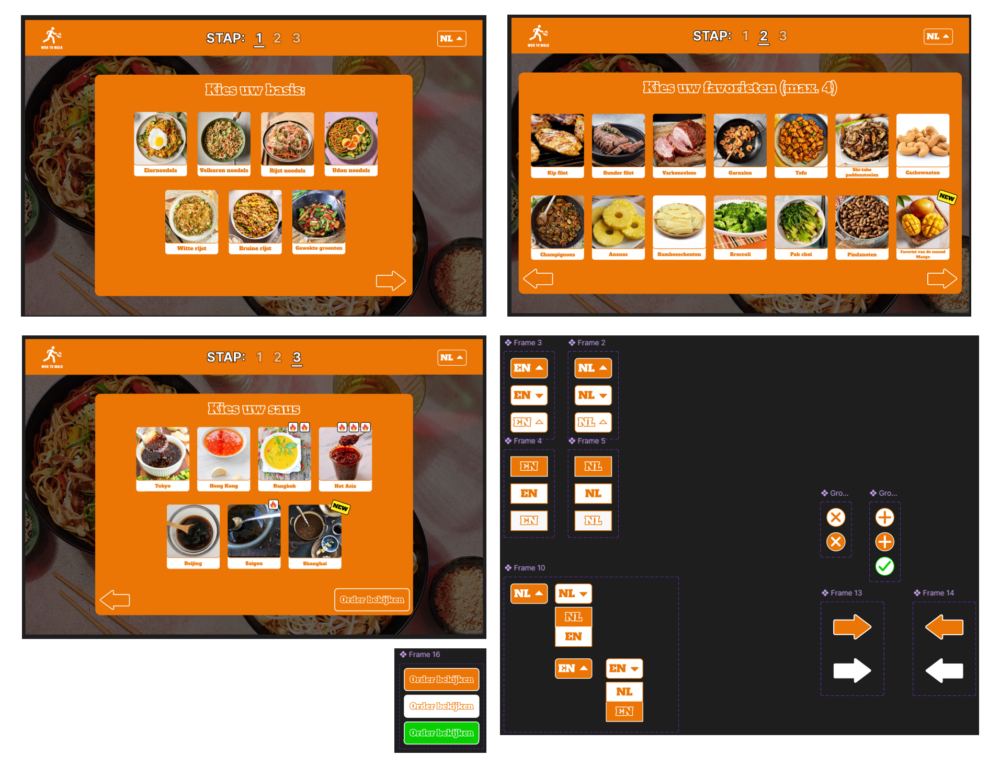

### 2 sept - CSS: fonts met kleur en effecten 
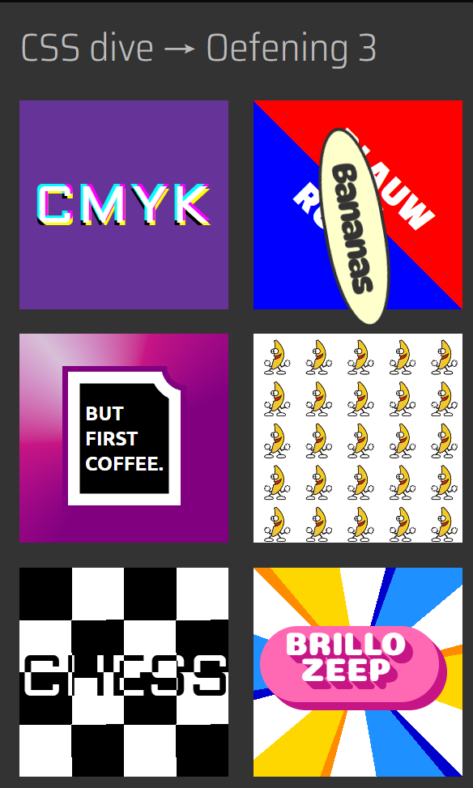

### 4 sept - Praktische CSS
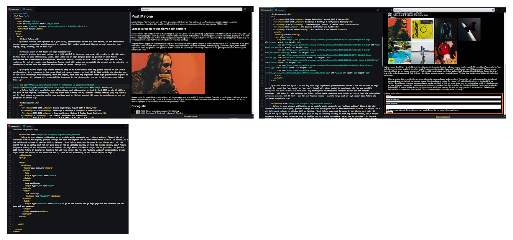

### Uitgebreid Creatief Proces & Ontwerpkeuzes

Het ontwerp van deze website is niet zomaar ontstaan, maar is het resultaat van een zorgvuldig doorlopen creatief proces. Onderzoek naar de Texaanse cultuur, countrymuziek en de sfeer rondom honky-tonk bars en saloons is vertaald naar visuele keuzes, interactie en unieke websitecomponenten.

---

**Van Moodboard naar Kleurenpalet en Sfeer:**

Het visuele startpunt was het verzamelen van beeldmateriaal in een uitgebreid moodboard. Hierin kwamen onder andere klassieke festivalposters, rodeo-evenementen, Texaanse landschappen, countrybars en iconische portretten van countryartiesten terug. Vanuit deze beelden is een warm en rustiek kleurenpalet ontwikkeld met diepe houttinten, warme bruinen en goudachtige accenten.

Deze combinatie zorgt ervoor dat de website een herkenbare country-uitstraling krijgt. De sfeer is geïnspireerd op een authentieke *honky-tonk* bar en traditionele materialen zoals hout en leer. Hierdoor voelt de website minder aan als een standaard webpagina en meer als een digitaal plakboek dat aansluit bij het onderwerp.

| Visueel Onderzoek | Abstract Onderzoek |
| :---: | :---: |
| 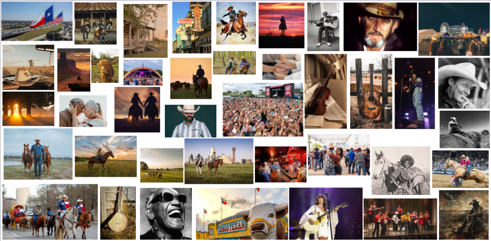 | 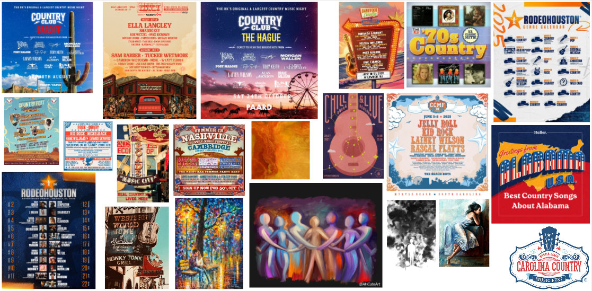 |
| *Kleuren, sfeer en beeldgebruik* | *Vormen, composities en richtingen* |

---

**Van Onderzoek naar Eerste Ideeën:**

Na het verzamelen van inspiratie zijn verschillende ideeën en mogelijke richtingen uitgewerkt. Hiervoor zijn onder andere de Crazy 8's gebruikt om in korte tijd meerdere concepten te bedenken en visueel te verkennen.

| Crazy 8's (1 t/m 4) | Crazy 8's (5 t/m 8) |
| :---: | :---: |
| 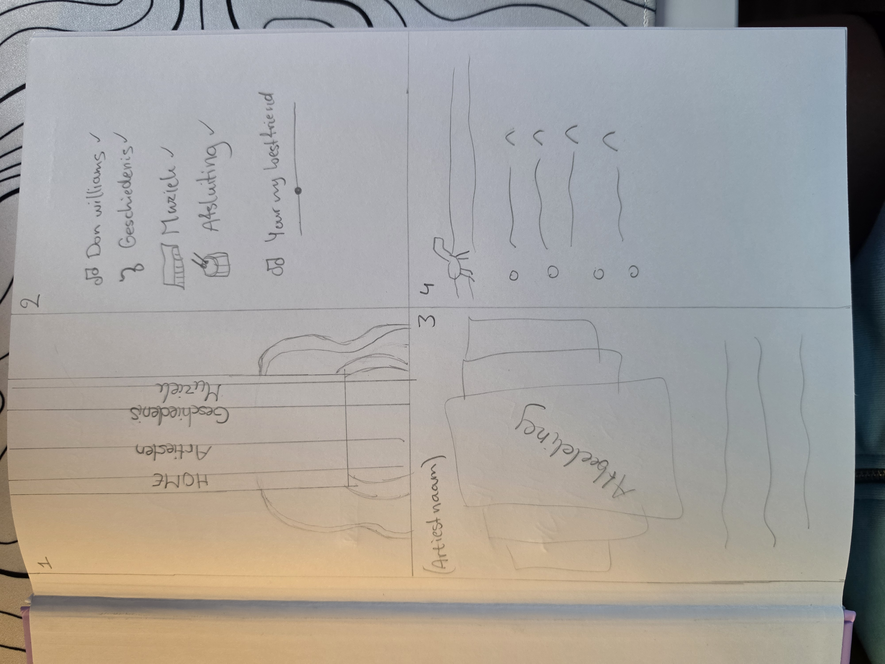 | 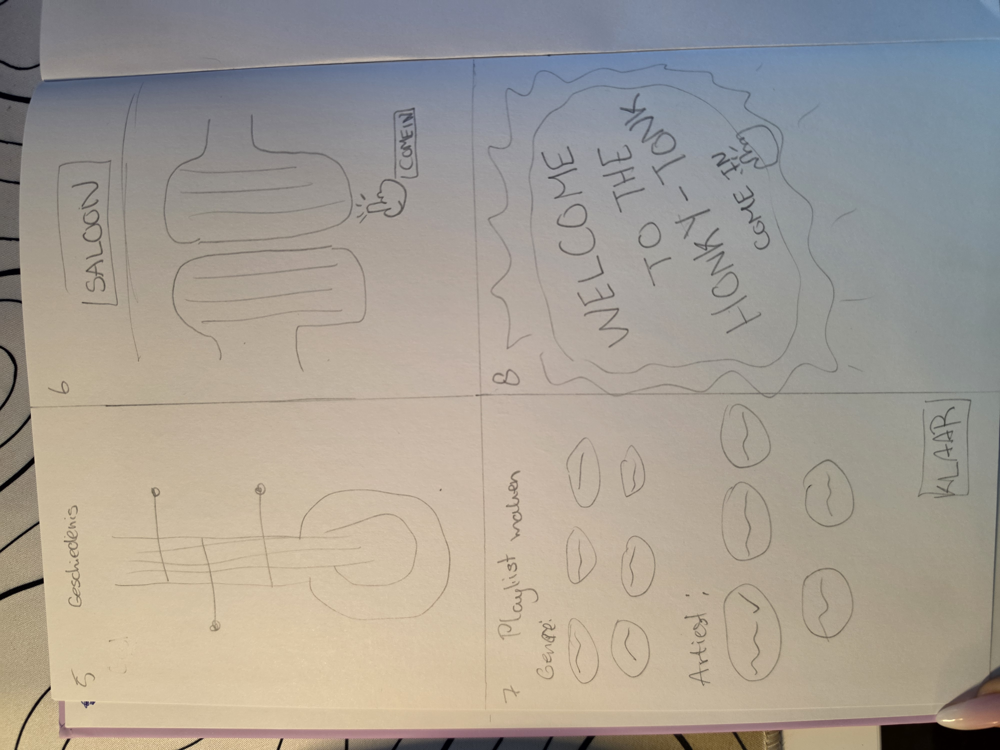 |
| *Eerste vier conceptschetsen* | *Laatste vier conceptschetsen* |

---

**Het Saloon-startscherm & Thematische Beleving:**

Geïnspireerd door old-school countrybars en saloons ontstond het idee voor de introductiepagina. Dit resulteerde in een interactief startscherm met saloondeuren en dynamische, geanimeerde gradientkleuren op de achtergrond.

Tijdens het ontwerpproces is het startscherm meerdere keren aangepast voordat de uiteindelijke versie werd gekozen.

| Eerste Iteratie | Finale Versie |
| :---: | :---: |
| 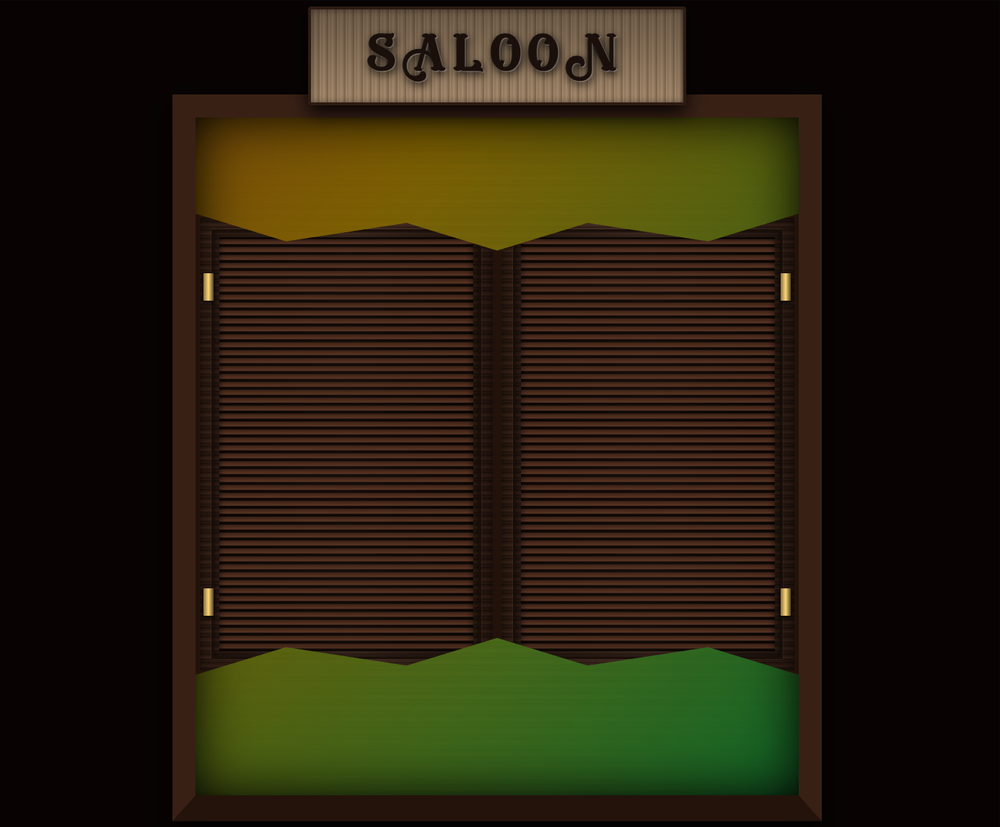 | 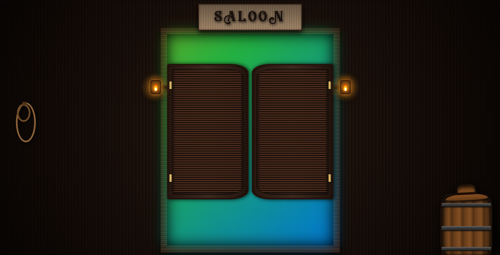 |
| *Procesfase startscherm* | *Uiteindelijke versie* |

Wanneer de bezoeker met de cursor over de saloondeuren beweegt, verschijnt een kleine cursor-tool met de tekst **“Come In”**. Na het aanklikken van de deuren wordt een animatie uitgevoerd waarbij de deuren opengaan en de gebruiker wordt verwelkomd op de website.

---

**De Opbouw van het Homescreen & Navigatie:**

Al tijdens de eerste schetsfase is de structuur van de website gekoppeld aan het thema muziek. Dit is onder andere terug te zien in de navigatie en de visuele lijnen van de startpagina, die zijn geïnspireerd op de snaren en hals van een akoestische gitaar.

Ook het homescreen is tijdens het proces meerdere keren aangepast.

| Eerste Iteratie | Finale Versie |
| :---: | :---: |
| 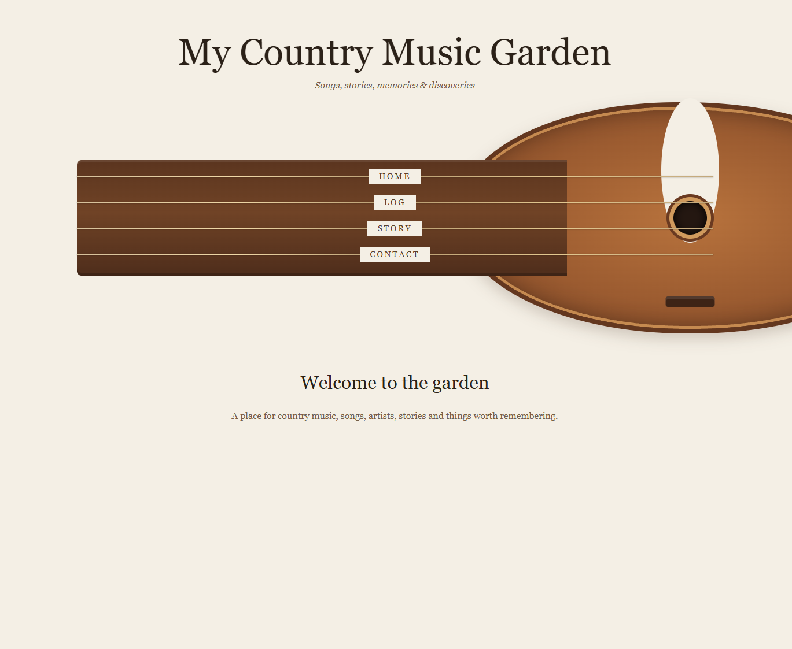 | 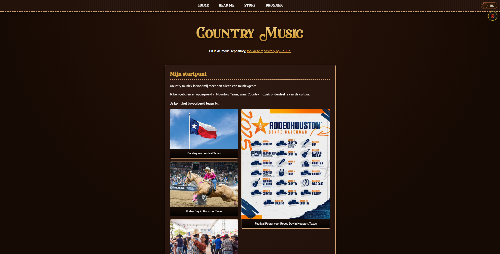 |
| *Procesfase homescreen* | *Uiteindelijke versie* |

De startpagina zelf is bewust overzichtelijk en rustig gehouden, zodat de verschillende onderdelen van de Digital Garden niet met elkaar concurreren. De content is verdeeld over gestapelde kaarten (*cards*). Deze kaarten versterken het gevoel van een fysiek plakboek en sluiten tegelijkertijd aan bij het idee van een Digital Garden waarin informatie steeds verder kan worden uitgebreid en verbonden.

---

**Specifieke Componenten & Micro-interacties:**

  - **Navbar & Responsief Banjo-menu:**

    De navigatiebalk sluit qua stijl aan bij de houten accenten en de algemene country-esthetiek van de website. Ook de navbar heeft verschillende ontwerpiteraties doorlopen voordat de uiteindelijke versie werd gekozen.

    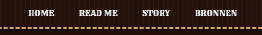

    *Uiteindelijke versie van de navigatiebalk.*

    Voor kleinere schermen is een apart mobiel menu ontworpen. Het oorspronkelijke idee was om hiervoor een gitaar als interactief element te gebruiken. Omdat een realistische gitaar met pure CSS onnodig complex zou worden, is gekozen voor een vereenvoudigde banjo.

    De banjo heeft meerdere iteraties doorlopen:

    | Banjo Iteratie 1 | Banjo Iteratie 2 | Finale Banjo-menu |
    | :---: | :---: | :---: |
    | 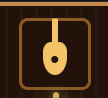 | 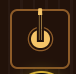 | 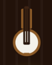 |
    | *Eerste opzet* | *Tweede iteratie* | *Uiteindelijk menu-icoon* |

    Door op het banjo-icoon te klikken, wordt het mobiele navigatiemenu geopend.

  - **Custom Scrollbar – Vinylplaat:**

    Om de standaard browser-scrollbar te vervangen door een element dat beter bij het thema past, is een custom scrollbar ontworpen in de vorm van een vinylplaat.

    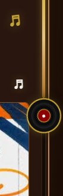

    *Ontwerp van de custom scrollbar.*

    Tijdens het scrollen verschijnen er muzieknoten rondom de plaat. Een gouden lijn beweegt mee en geeft visueel aan hoe ver de gebruiker zich op de pagina bevindt. Hierdoor wordt een functioneel onderdeel van de website tegelijkertijd onderdeel van de visuele identiteit.

---

**Bronnenpagina:**

  De bronnenpagina is bewust overzichtelijk en georganiseerd gehouden. Hier kunnen gebruikers eenvoudig de gebruikte bronnen, afbeeldingen en andere relevante materialen terugvinden.

  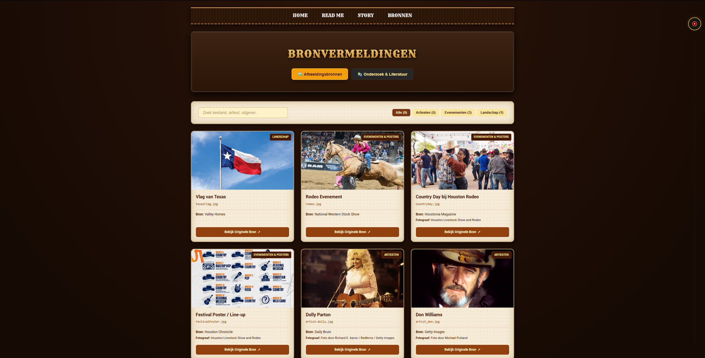

  *De uiteindelijke bronnenpagina.*

### Ontwerp als Samenhangend Geheel

Hoewel ieder onderdeel afzonderlijk is ontworpen, zijn de verschillende componenten bewust met elkaar verbonden. Het kleurenpalet, de houten en leren uitstraling, de muziekgerelateerde interacties, de saloondeuren, de banjo en de vinyl-scrollbar dragen allemaal bij aan dezelfde visuele identiteit. Hierdoor voelt de website niet als een verzameling losse elementen, maar als één samenhangende digitale omgeving rondom countrymuziek en de Texaanse cultuur.

### Ontwerp als Samenhangend Geheel

Hoewel ieder onderdeel afzonderlijk is ontworpen, zijn de verschillende componenten bewust met elkaar verbonden. Het kleurenpalet, de houten en leren uitstraling, de muziekgerelateerde interacties, de saloondeuren, de banjo en de vinyl-scrollbar dragen allemaal bij aan dezelfde visuele identiteit. Hierdoor voelt de website niet als een verzameling losse elementen, maar als één samenhangende digitale omgeving rondom countrymuziek en de Texaanse cultuur.

## Bronnen

### Bronnen voor Onderzoek

<b>📂 Klik hier om alle onderzoeksbronnen te bekijken (10 bronnen)</b>

 

| Bron | Beschrijving | Link |
| :--- | :--- | :--- |
| **Country Music Hall of Fame** | Country Music History | [Openen](https://www.countrymusichalloffame.org/learn/country-music-history) |
| **Plumrose Publishing** | The History of Country Music | [Openen](https://plumrosepublishing.com/the-history-of-country-music/) |
| **Encyclopædia Britannica** | Bluegrass Music | [Openen](https://www.britannica.com/art/bluegrass-music) |
| **PBS (Ken Burns)** | Roots & Branches of Country Music | [Openen](https://www.pbs.org/kenburns/country-music/roots-branches-of-country-music) |
| **Grizzly Rose** | History of Country Music | [Openen](https://grizzlyrose.com/history-of-country-music/) |
| **Tulane University** | Music Rising: Country Music | [Openen](https://musicrising.tulane.edu/discover/themes/country-music/) |
| **Medium** | A Brief History of Country Music | [Openen](https://midweekcrisis.medium.com/a-brief-history-of-country-music-ca72e8fff803) |
| **Musicnotes** | History & Influences | [Openen](https://www.musicnotes.com/blog/an-american-tradition-the-history-of-country-music-influences/?srsltid=AfmBOopG-MGnrjlAKgoXNbYHh73PstFLviQs8-YRZ_68QN1us4Aj6wYG) |
| **Library of Congress** | Country Music Timeline | [Openen](https://www.loc.gov/collections/dolly-parton-and-the-roots-of-country-music/articles-and-essays/country-music-timeline/) |
| **OK History** | Country Music Entry | [Openen](https://www.okhistory.org/publications/enc/entry?entry=CO072) |

### Bronnen van Afbeeldingen

Een overzicht van alle visuele media, fotografie, posters en afbeeldingen die in dit project worden gebruikt.

Bestandsmap: `assets/resources/images/`

<b>📷 Klik om de Bronnentabel te Openen / Sluiten</b>

 

| Miniatuur | Bestandspad & Titel | Categorie | Bron / Uitgever | Originele Webkoppeling |
| :---: | :--- | :---: | :--- | :---: |
| 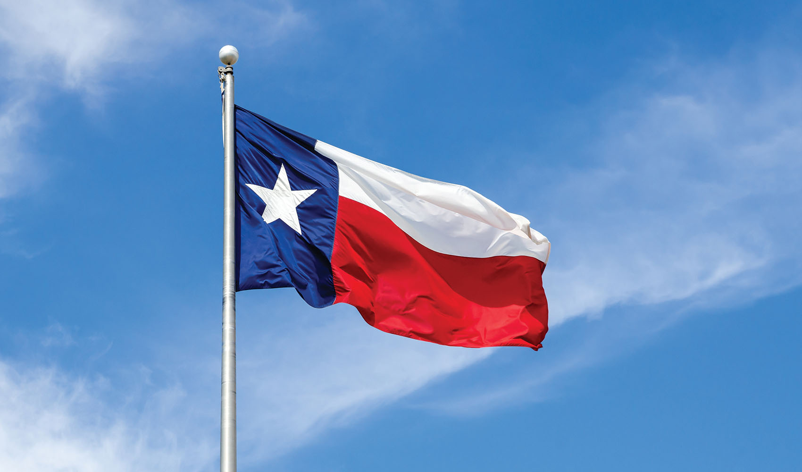 | **Vlag van Texas** `assets/resources/images/texasFlag.jpg` | `Landschap` | **Valley Homes** | [Bekijk Bron](https://valleyhomeslc.com/location/mobile-homes-for-sale-dumas-tx/) |
| 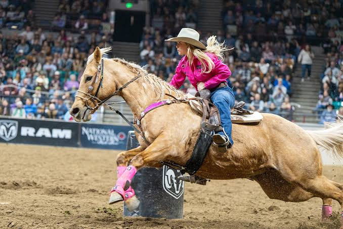 | **Rodeo Evenement** `assets/resources/images/rodeo.jpg` | `Evenementen & Posters` | **National Western Stock Show** | [Bekijk Bron](https://nationalwestern.com/rodeos/) |
| 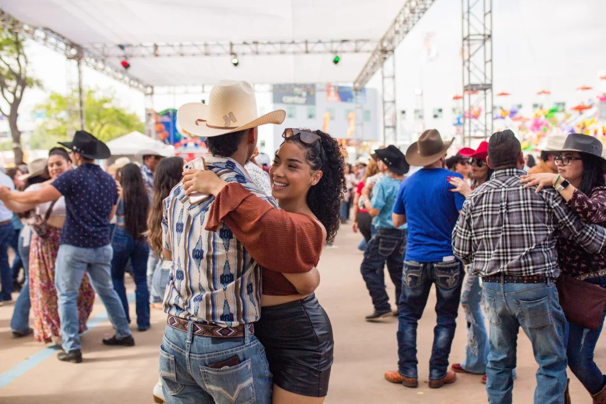 | **Country Day bij Houston Rodeo** `assets/resources/images/CountryDay.jpg` | `Evenementen & Posters` | **Houstonia Magazine** *Houston Livestock Show and Rodeo* | [Bekijk Bron](https://www.houstoniamag.com/arts-and-culture/2025/03/houston-rodeo-best-days-to-visit) |
| 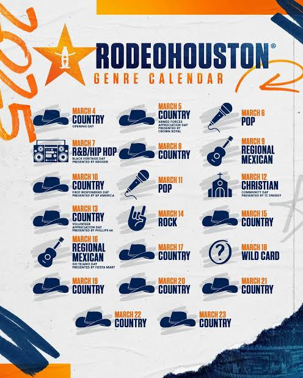 | **Festival Poster / Line-up** `assets/resources/images/FestivalPoster.jpg` | `Evenementen & Posters` | **Houston Chronicle** *Houston Livestock Show and Rodeo* | [Bekijk Bron](https://www.houstonchronicle.com/entertainment/music/article/houston-rodeo-genre-calendar-2025-acts-lineup-tix-19934612.php) |
| 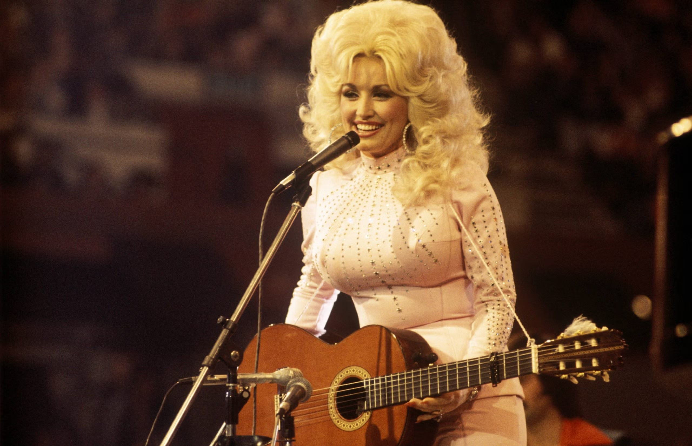 | **Dolly Parton** `assets/resources/images/artist-dolly.jpg` | `Artiesten` | **Daily Bruin** *Foto door Richard E. Aaron / Redferns / Getty Images* | [Bekijk Bron](https://dailybruin.com/2026/08/27/in-moments-remembering-queen-of-country-dolly-partons-career) |
| 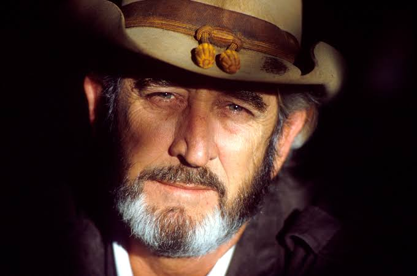 | **Don Williams** `assets/resources/images/artist_don.jpg` | `Artiesten` | **Getty Images** *Foto door Michael Putland* | [Bekijk Bron](https://www.gettyimages.nl/detail/nieuwsfoto%27s/don-williams-portrait-london-1989-nieuwsfotos/109364677?adppopup=true) |
| 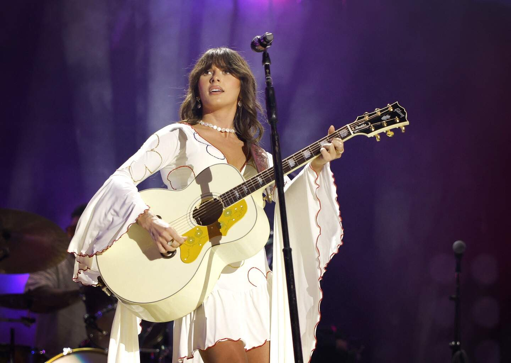 | **Ella Langley** `assets/resources/images/artist_ella.jpg` | `Artiesten` | **Woman's World** | [Bekijk Bron](https://www.womansworld.com/entertainment/celebrities/ella-langley-before-fame-was-totally-different-how-she-found-her-look) |
| 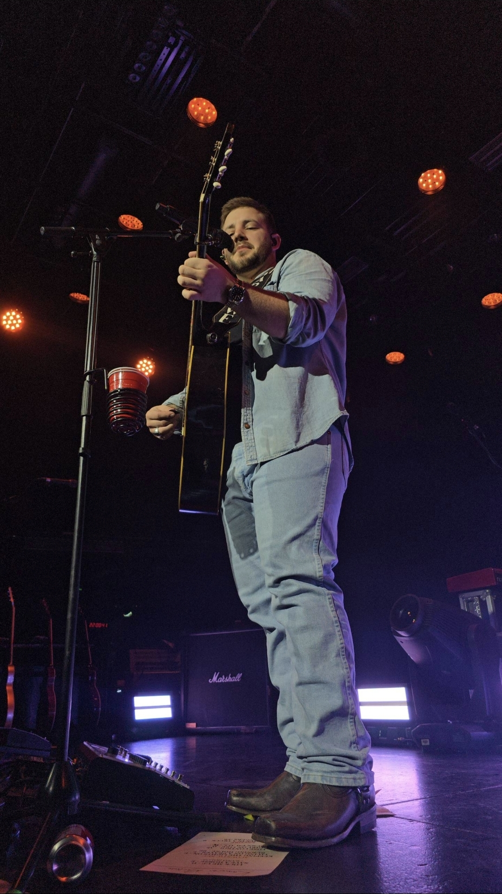 | **Kameron Marlowe** `assets/resources/images/artist_kameron.jpg` | `Artiesten` | **Oluwaseyi Davies** *Directe vermelding* | *Directe Vermelding* |
| 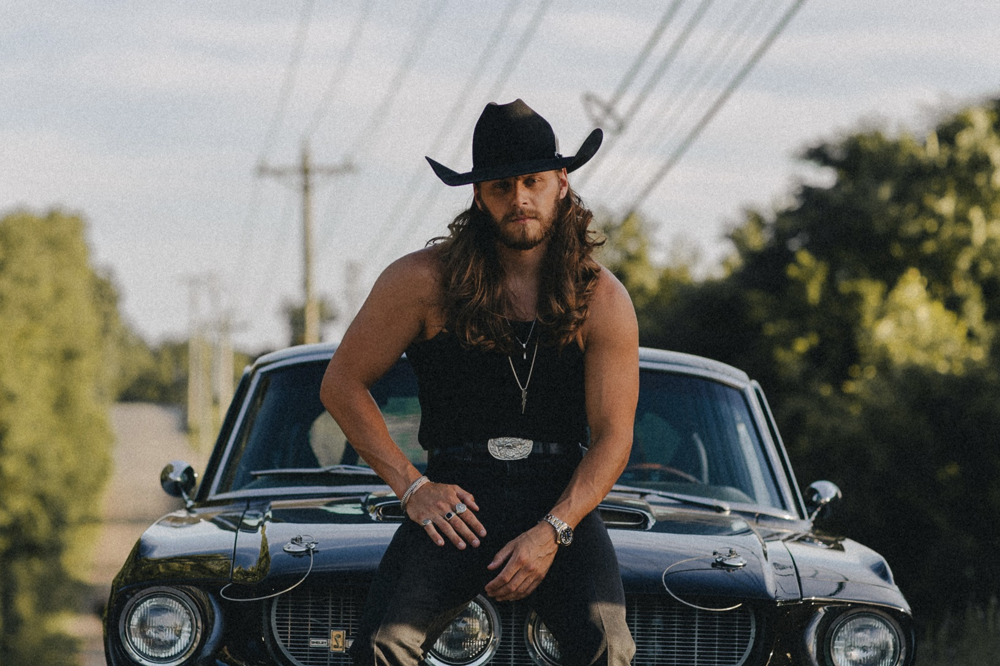 | **Warren Zeiders** `assets/resources/images/artist_warren.jpg` | `Artiesten` | **Wikipedia** | [Bekijk Bron](https://en.wikipedia.org/wiki/Warren_Zeiders) |

---
*Alle gebruikte afbeeldingen blijven het eigendom van de respectievelijke makers en uitgevers. Opgenomen voor educatieve en portfolio-doeleinden.*