# Garnet’s Ocean — Country Roots

Mijn digital garden over countrymuziek, met Houston, Texas als persoonlijk startpunt. De website bevat een saloon-startscherm, een homepage, een bronnenpagina en privacy-informatie. Voor Country Roots is een eerste paginaopzet uitgewerkt.

Dit project is begonnen als fork van de modelrepository voor 'Het web is voor iedereen'.

Website: [garnetsocean.nl](https://garnetsocean.nl)

## Learning Log

### 31 aug - Kickoff

Een fork van de model repository gemaakt en gepubliceerd via mijn eigen Github omgeving.

### Checkouts 

#### Bryenne - 31-08-2026
1. Een source hosting platform is een platform waarop jouw source code kan worden behouden/beheerd. Ik heb gekozen voor Github omdat ik daar het meest bekend mee ben.
2. Ik heb mijn gamerTag Garnet Oceans gebruikt als inspiratie gebruikt voor mijn domeinnaam. Maar inplaats van Garnet Oceans heb ik het veranderd naar Garnets Ocean zodat het meer persoonlijker werd in verband met mijn Digital Garden. 
3. Ik kan in VSCodium aanpassingen maken op mijn web pagina en deze publiceren door mijn code op te slaan en te pushen naar de main via de gekozen hosting platform. Hierbij heb ik ook via transip.nl een domeinnaam aangemaakt waardoor alles wat ik heb gecodeerd komt op mijn website te staan.

### Weekoverzicht

De onderdelen hieronder vullen mijn eerdere log aan. De werkzaamheden van week 2, 3 en 4 zijn per week beschreven. Waar nog geen exacte datum, feedback of testuitkomst is vastgelegd, staat aangegeven wat ik nog moet aanvullen.

| Week | Periode | Vastgelegd / nog aanvullen |
| :--- | :--- | :--- |
| 1 | 31 augustus–6 september 2026 | Kickoff, checkout en workshops staan hierboven. Persoonlijke reflectie op de workshops nog aanvullen. |
| 2 | 7–13 september 2026 | Eerste saloon en homepage, lichte modus, kleine schermen en presentatie over mijn onderwerpkeuze. |
| 3 | 14–20 september 2026 | Vertaalfunctie, bronnenpagina en custom scrollbar toegevoegd; HTML gevalideerd. |
| 4 | 21–27 september 2026 | Thema's op andere pagina's, toegankelijkheid en de eerste story-pagina. |
| 5 | 28 september–5 oktober 2026 | Verdere verfijning van CSS, kleurconflicten, de afbeeldingspopup en Country Roots. Hieronder staat een tussenstand; de week is nog niet afgerond. |

#### Week 1 — Reflectie op de workshops

##### 2 sept - Interactie: MMD, microinteracties, forms
 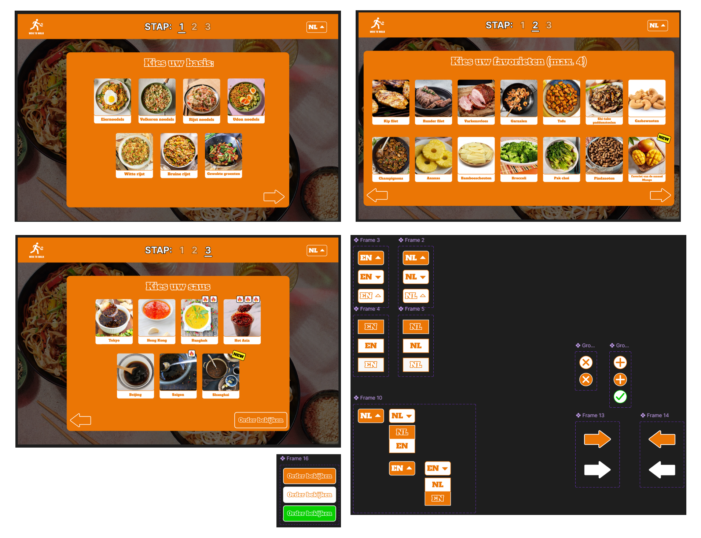

##### 2 sept - CSS: fonts met kleur en effecten 
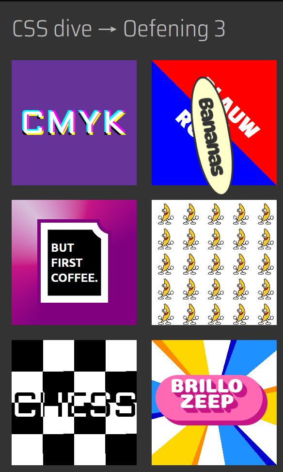

##### 4 sept - Praktische CSS
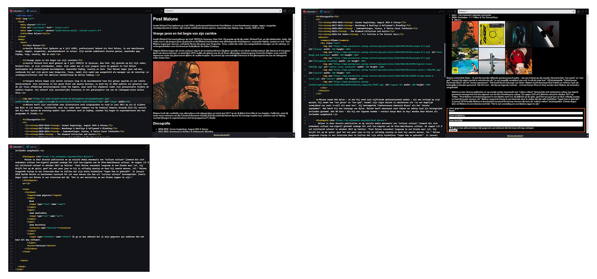

#### Week 2 — De eerste website en mijn onderwerpkeuze

**De saloon en homepage bouwen**

Deze week heb ik het begin van mijn website gemaakt: de saloon als ingang en de homepage met mijn introductie over Country Music. De saloon had toen nog geen privacypopup en de homepage nog geen custom scrollbar. Die onderdelen horen bij latere versies van het ontwerp.

Ik heb ook een lichte modus gemaakt en de indeling aangepast voor kleine schermen. Daarbij was het belangrijk dat het ontwerp niet alleen op mijn eigen scherm paste, maar dat de inhoud en navigatie ook op een smaller scherm bruikbaar bleven.

| Eerste Iteratie Start| Eerste Iteratie Home | Tweede Iteratie Home |
| :---: | :---: | :---: |
| 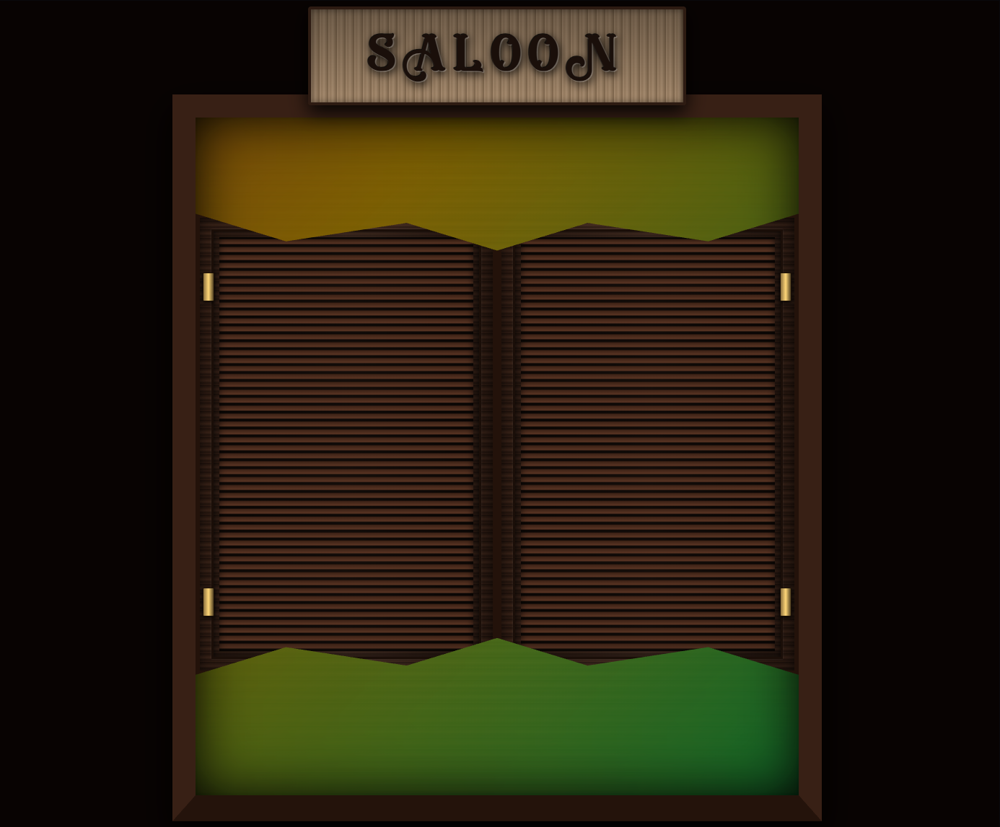 | 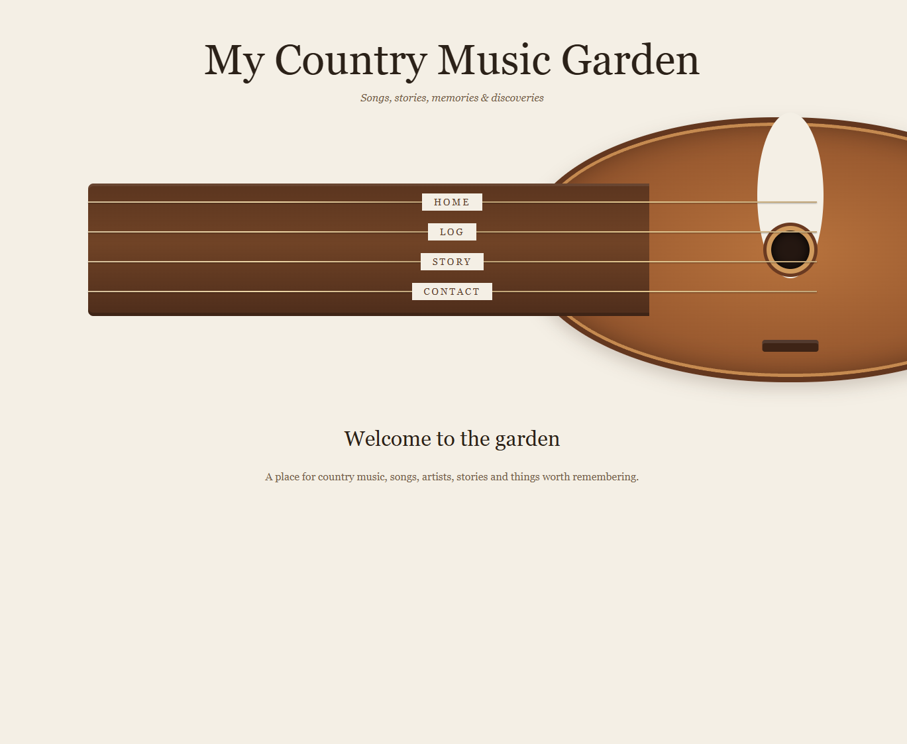 | 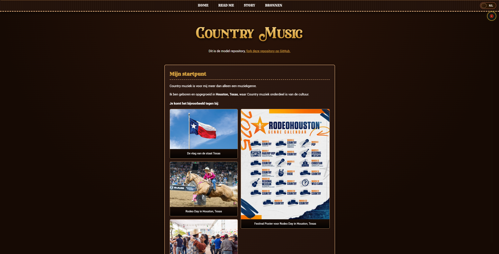 |

**Mijn keuze voor Country Music uitleggen**

Ik heb een presentatie gemaakt om aan een medestudent uit te leggen waarom ik Country Music als onderwerp voor mijn digital garden heb gekozen. Mijn persoonlijke startpunt is Houston, Texas, waar ik ben geboren en opgegroeid. Country muziek hoort voor mij bij de cultuur en biedt verschillende richtingen om verder te ontdekken: artiesten, muziekstijlen, rodeo, geschiedenis en invloeden uit andere genres.

De presentatie was bedoeld om duidelijk te maken hoe die onderwerpen met elkaar verbonden kunnen worden. Vanuit één artiest of nummer kan ik steeds een nieuw onderwerp onderzoeken. Dat sluit aan bij een digital garden die niet meteen af hoeft te zijn.

#### Week 3 — Taalkeuze, bronnen, scrollbar en HTML-validatie

**Nederlands en Engels**

Deze week heb ik een vertaalfunctie toegevoegd, zodat bezoekers tussen Nederlands en Engels kunnen wisselen. De teksten staan samen in `translations.json` onder `NL` en `ENG`. In de HTML verwijzen de `data-i18n`-attributen naar de juiste teksten. De taalkeuze wordt bewaard in `localStorage`.

De taalwisselaar moest ook passen bij het mobiele menu. Op kleine schermen zat de knop het banjo-icoon in de weg. Daarom moest de taalkeuze daar in het uitklapmenu komen. Dit liet zien dat een nieuw onderdeel invloed heeft op de bestaande navigatie, ook wanneer het op een groot scherm wel goed past.

| Engels Vertaling | Nederlandse Vertaling |
| :---: | :---: |
| 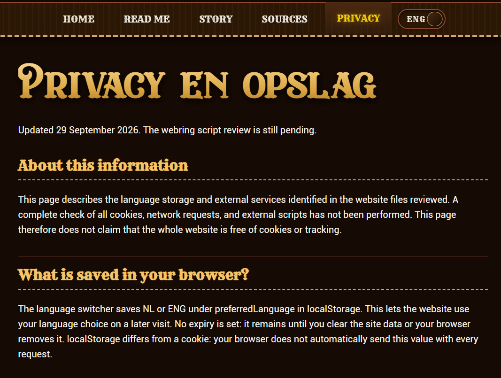 | 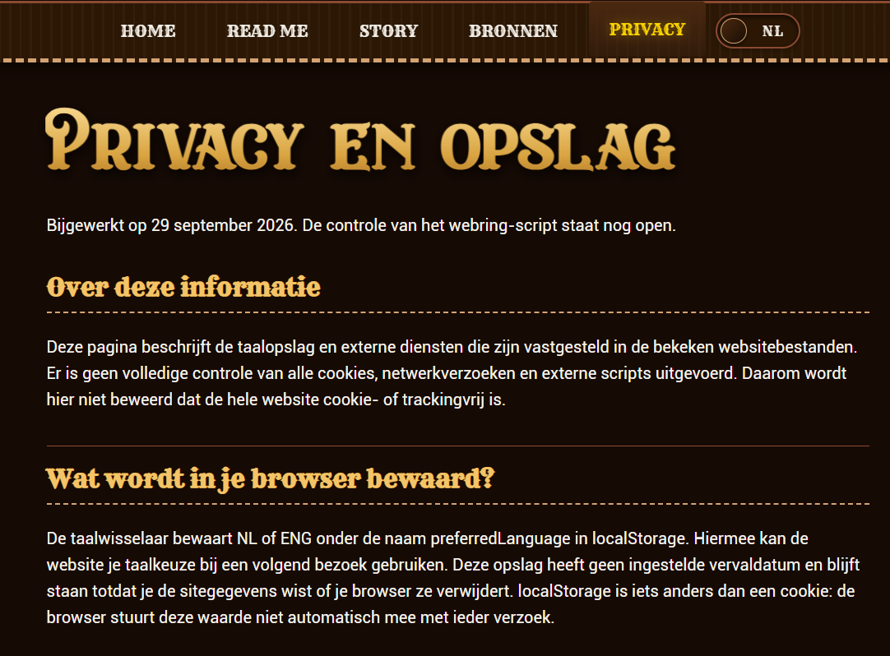 |

**Een aparte bronnenpagina**

Ik heb een bronnenpagina toegevoegd om de gebruikte afbeeldingen en onderzoeksbronnen bij elkaar te zetten. Bij de afbeeldingen staan onder andere de bestandsnaam, bron of uitgever en eventuele credits. De pagina heeft een zoekveld en categorieknoppen om afbeeldingen terug te vinden, en een apart overzicht voor onderzoek en literatuur.

Bij het vertalen moeten niet alleen koppen en alinea's worden meegenomen, maar ook knoppen, zoekteksten en de inhoud die JavaScript opbouwt. De categoriewaarden waarmee het filter werkt, kunnen hetzelfde blijven terwijl de zichtbare labels veranderen.

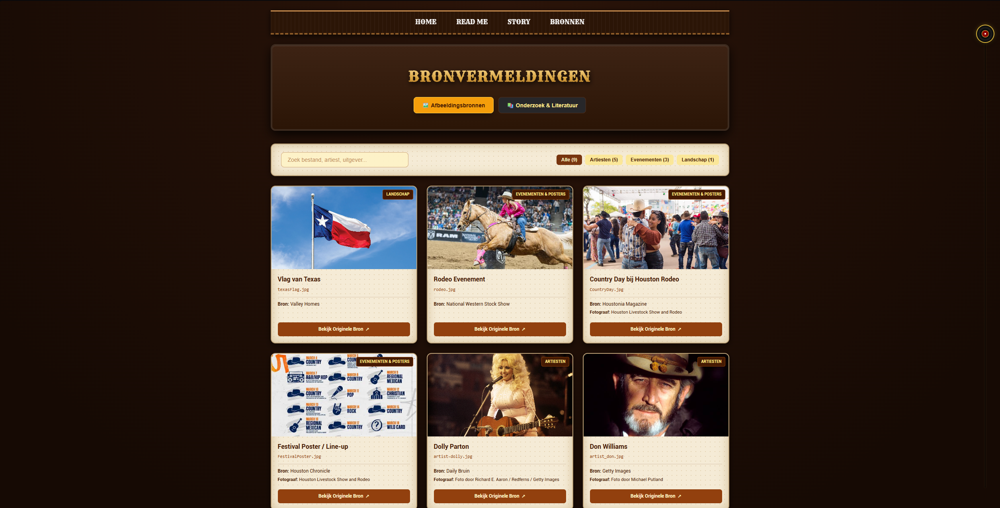

**Custom scrollbar als vinylplaat**

Deze week heb ik ook de custom scrollbar gemaakt. In plaats van de standaard scrollbar gebruikt mijn website een vinylplaat die bij het muziekthema past. Een gouden lijn laat zien hoe ver de bezoeker op de pagina is. Tijdens het scrollen verschijnen er muzieknoten rondom de plaat.

De vormgeving staat in `custom-scrollbar.css` en de interactie in `custom-scrollbar.js`. Zo kan ik de uitstraling aanpassen zonder de werking en styling door elkaar te zetten. Het ontwerp staat verderop in de README bij de componenten en micro-interacties.

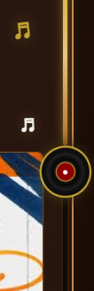

**HTML-validatie**

De validator gaf meldingen over een ontbrekende `src` bij de modalafbeelding, een dubbel gebruikt `modalImg`-ID en een `section` zonder kop. Deze meldingen maakten duidelijk dat een alt-tekst geen afbeeldingsbron vervangt en dat een ID maar één keer op een pagina mag voorkomen. Een inhoudelijke sectie heeft een passende kop nodig.

IDs zijn wel nuttig voor gerichte verwijzingen: bijvoorbeeld een skip link naar de hoofdinhoud, een label dat naar een invoerveld verwijst of `aria-labelledby` dat een dialoog met zijn titel verbindt. De laatste versies moeten opnieuw door de validator; hier staat nog geen bevestiging dat alle meldingen zijn opgelost.

| Eerste Error | Tweede Error |
| :---: | :---: |
| 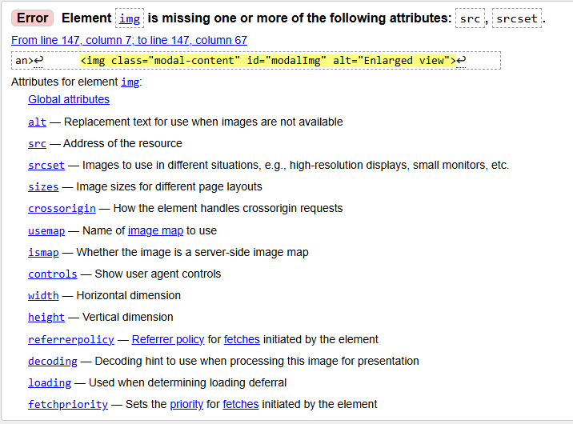 | 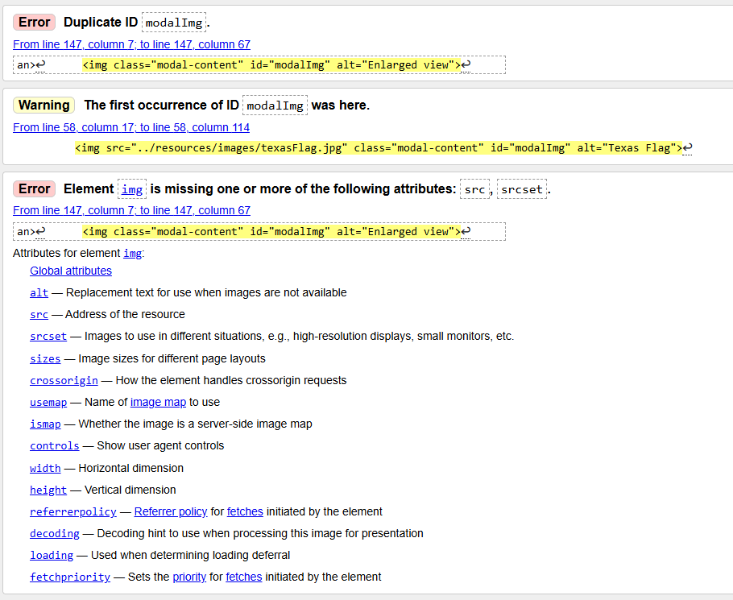 |

#### Week 4 — Thema's, toegankelijkheid en het begin van mijn garden

**Lichte en donkere modus uitbreiden**

Deze week heb ik lichte en donkere modus ook aan mijn andere pagina's toegevoegd. De pagina's volgen de kleurvoorkeur van de bezoeker via `prefers-color-scheme`. Daarbij moeten tekst, achtergronden, knoppen en focusranden bij elkaar passen. Alleen de achtergrond lichter maken is niet genoeg als de tekst ook licht blijft.

**Werken aan toegankelijkheid**

Ik heb gewerkt aan de bruikbaarheid met een screenreader en aan andere toegankelijkheidsaspecten, zoals bediening met het toetsenbord, duidelijke labels en zichtbare focus.

Voor het testen is Edge gekozen. Bij het doorlopen van de bronnenpagina werd gemeld dat het zoekveld en de filters te weinig uitleg gaven. Een bronlink las alleen ‘Bekijk Originele Bron’ voor, zonder duidelijk te maken bij welke afbeelding die hoorde.

Daarvoor zijn de volgende aanpassingen uitgewerkt:

- Het zoeklabel koppelen aan het juiste input-ID en de werking uitleggen via `aria-describedby`.
- Filterknoppen een beschrijving geven en de geselecteerde staat communiceren met `aria-pressed`.
- Bronlinks een naam geven zoals ‘Bekijk Originele Bron — Vlag van Texas — Bron: Valley Homes’, met aanvullende informatie over bestand en credits.
- Het aantal zoekresultaten laten melden zonder bij elke toetsaanslag direct een nieuwe melding te geven.
- Skip links toevoegen zodat de navigatie kan worden overgeslagen.
- Extra linkcontext visueel verbergen, terwijl deze voor screenreaders beschikbaar blijft.

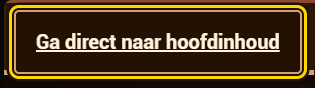
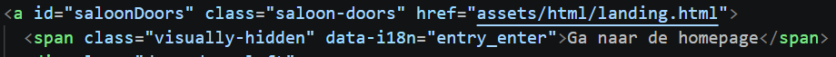

Tab doorloopt de interactieve elementen. De gewone tekst van een bronkaart hoeft daarom geen aparte Tab-stop te worden. Die tekst blijft via de leescommando's van de screenreader beschikbaar. De precieze uitspraak moet nog met de gebruikte screenreader worden vastgelegd.

Bij de saloondeuren is daarnaast gewerkt aan een echte link, een verborgen toegankelijke naam en het behouden van de zichtbare ‘Come In!’-tooltip. In een aangeleverde scriptversie kwamen een niet-overeenkomende selector en verschillende schrijfwijzen van variabelen voor. Dit liet zien hoe belangrijk het is dat HTML, CSS en JavaScript dezelfde namen gebruiken.

Dit beschrijft de werkzaamheden en gevonden problemen. De gebruikte screenreader, versie en concrete uitkomsten van de controles moet ik nog toevoegen; daarmee kan ik laten zien wat daadwerkelijk is gecontroleerd.

**Een start maken met de story-pagina**

Ik heb een story-pagina toegevoegd als begin van mijn digital garden. Daarmee kreeg de website naast de introductie en bronnen ook een plek voor onderwerpen en notities die ik verder kan uitwerken. De verdere uitwerking van deze pagina staat bij de latere verfijningen hieronder.

#### Week 5 — Tussenstand: opruimen en verder verfijnen

**CSS overzichtelijker maken**

De stylesheets zijn apart doorgenomen: `bronnen.css`, `custom-scrollbar.css`, `landing.css`, `language-changer.css`, `navbar.css`, `privacy.css`, `story.css` en `style.css`. De afgesproken volgorde is `:root`, eventuele `@font-face`-regels, de overige styling en onderaan de media queries. De hoofdonderdelen krijgen herkenbare `MARK:`-commentaren. Waar nog Flexbox stond, is een Grid-uitwerking gemaakt, omdat Grid een eis is voor mijn project.

Een aandachtspunt hierbij is dat opruimen de bestaande interacties niet mag veranderen. De deurtooltip, de banjo en de toetsenbordstijlen moeten blijven werken. De aangepaste bestanden moeten daarom ook nog in samenhang worden bekeken; alleen een overzichtelijk CSS-bestand zegt niet of de pagina goed werkt.

| @font-face | :root |
| :---: | :---: |
| 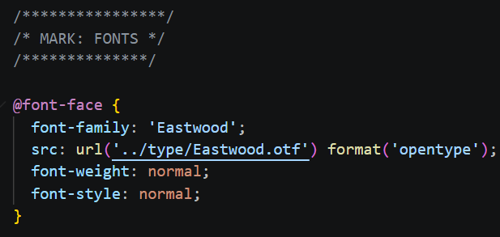 | 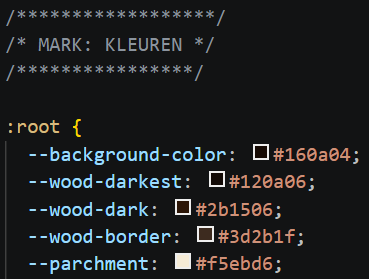 |

**Een kleurconflict in lichte modus oplossen**

Op de homepage was tekst in lichte modus bijna niet leesbaar. De achtergrond was licht, maar de tekst bleef ook licht. In de stylesheets werd `--main-font-color` op meerdere plekken in `:root` ingesteld. Een later geladen stylesheet kon daardoor de kleur overschrijven. De oplossing is om de inhoud eigen kleurvariabelen te geven, zodat de navigatie de tekstkleur van de pagina niet bepaalt.

Dit was een verdere verbetering van de thema's uit de eerdere weken. De kleuruitwerking is ook bij de bronnenpagina, privacypagina en privacymelding nagelopen. De laatste versies moeten nog in beide modi worden gecontroleerd, inclusief hover, toetsenbordfocus en open popups.

| Eerste Iteratie | Finale Versie |
| :---: | :---: |
| 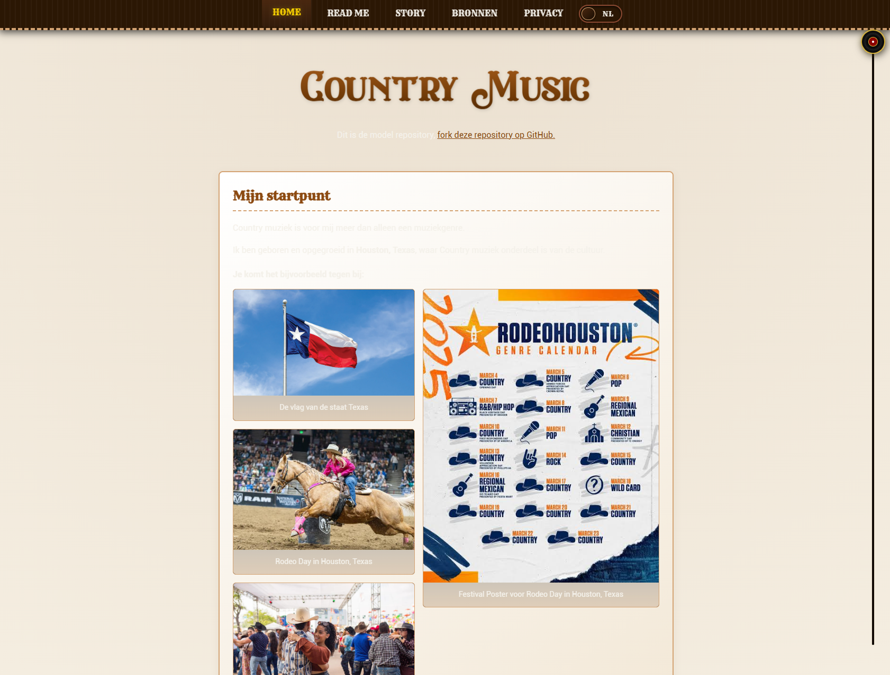 | 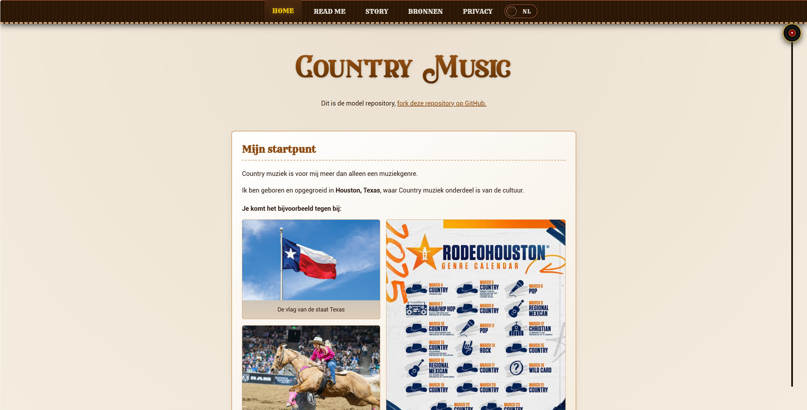 |
| *Procesfase home pagina* | *Uiteindelijke versie* |

**Afbeeldingen vergroten zonder de indeling kwijt te raken**

Bij de afbeeldingspopup zag ik een groot bruin vlak, scrollruimte en later veel ruimte tussen de foto en het bijschrift. De popup-CSS is daarop aangepast. Het doel is nu een foto met een passende maximale grootte, een rand en een aansluitend bijschrift met dezelfde breedte. De sluitknop staat rechts naast de afbeelding en toont een X. De knop kan voor een screenreader nog steeds de naam ‘Sluiten’ hebben.

De extra ruimte kwam in de gebruikte uitwerking door een dialoog die verticaal kon uitrekken en Grid-rijen die de overgebleven hoogte verdeelden. Hiervoor is een inhoudsafhankelijke hoogte uitgewerkt. Een volgende controle is om zowel staande als liggende foto's op een klein scherm te openen en te kijken of de sluitknop en het volledige bijschrift bereikbaar blijven.

**De story-pagina verder uitwerken tot Country Roots**

De in week 4 begonnen story-pagina is verder uitgewerkt als one-pager met de titel **Country Roots — Mijn muzikale tuin**. De inhoud gebruikt mijn bestaande startpunt in Houston, Texas en de vijf artiesten van de homepage: Dolly Parton, Don Williams, Ella Langley, Kameron Marlowe en Warren Zeiders.

De opzet bestaat uit mijn wortels, een doorzoekbare artiestenverzameling en eerste notities over muziekstijlen, cultuur en invloeden. De notities linken naar verwante onderwerpen en de bronnenpagina. Onderzoeksvragen zijn als vragen geformuleerd; ze zijn nog geen uitgewerkte onderzoeksresultaten. HTML, CSS en JavaScript staan in aparte bestanden. Nieuwe vertaalteksten zijn als aanvulling op het bestaande JSON-bestand aangeleverd.

De inhoudslinks hebben een CSS-uitwerking voor soepel scrollen. Bij `prefers-reduced-motion` blijft de sprong direct. Zo kan een kleine interactie aansluiten op de voorkeur van de bezoeker.

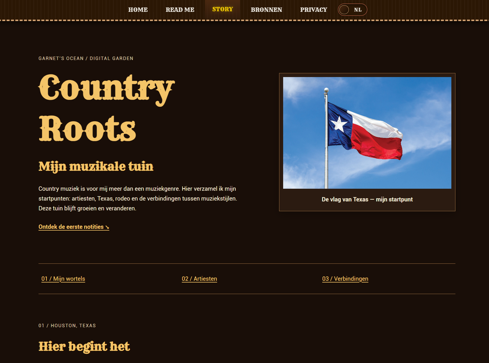

**Nog zelf aanvullen voor deze week**

- Welke van deze bestanden heb ik overgenomen en gepubliceerd? Voeg de commit of datum toe.
- Wat kan ik inmiddels zelf uitleggen of aanpassen zonder het voorbeeld erbij?
- Welke feedback heb ik van een docent of medestudent gekregen?
- Welke controles heb ik uitgevoerd en wat waren de resultaten?

#### Verdere aanpassingen aan de navigatie en taalwisselaar

De actieve paginalink moet overeenkomen met de huidige pagina; op een eerder screenshot werd ‘Bronnen’ gemarkeerd terwijl de homepage openstond.

Bij het hergebruiken van de taalwisselaar bleek dat `nav #langToggleBtn` alleen een knop binnen de navigatie selecteert. Voor dezelfde knop in de privacypopup moest de selector ook buiten `nav` werken. Tegelijk mogen de algemene popupknoppen de styling van de taalwisselaar niet overschrijven.

#### Privacy en opslag

Er is een informatieve melding voor `index.html` uitgewerkt, met een uitgebreidere privacypagina in de navigatie. De melding gaat onder andere over de opgeslagen taalkeuze en externe diensten. Het sluiten van de melding is niet bedoeld als toestemming voor tracking.

Ik wil hier onderscheid maken tussen cookies, `localStorage` en verzoeken naar andere diensten. Alleen geen cookies zien is onvoldoende om te concluderen dat er nergens gegevens worden verwerkt. De volledige controle van het externe webring-script en het netwerkverkeer staat nog open. De uiteindelijke privacytekst moet overeenkomen met wat de website daadwerkelijk doet.

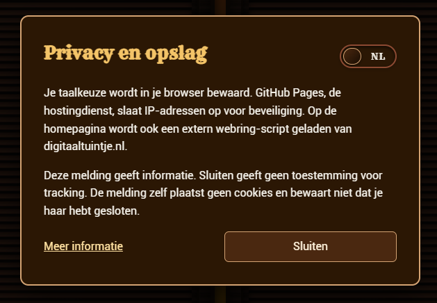

## Creatief proces en ontwerpkeuzes

Het ontwerp van deze website is niet zomaar ontstaan, maar is het resultaat van een zorgvuldig doorlopen creatief proces. Onderzoek naar de Texaanse cultuur, countrymuziek en de sfeer rondom honky-tonk bars en saloons is vertaald naar visuele keuzes, interactie en unieke websitecomponenten.

---

**Van Moodboard naar Kleurenpalet en Sfeer:**

Het visuele startpunt was het verzamelen van beeldmateriaal in een uitgebreid moodboard. Hierin kwamen onder andere klassieke festivalposters, rodeo-evenementen, Texaanse landschappen, countrybars en iconische portretten van countryartiesten terug. Vanuit deze beelden is een warm en rustiek kleurenpalet ontwikkeld met diepe houttinten, warme bruinen en goudachtige accenten.

Deze combinatie zorgt ervoor dat de website een herkenbare country-uitstraling krijgt. De sfeer is geïnspireerd op een authentieke *honky-tonk* bar en traditionele materialen zoals hout en leer. Hierdoor voelt de website minder aan als een standaard webpagina en meer als een digitaal plakboek dat aansluit bij het onderwerp.

| Visueel Onderzoek | Abstract Onderzoek |
| :---: | :---: |
| 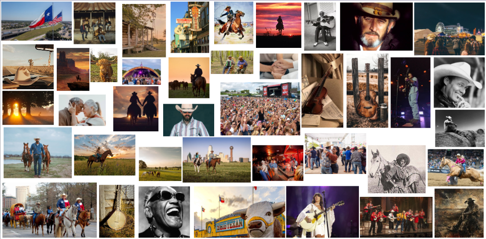 | 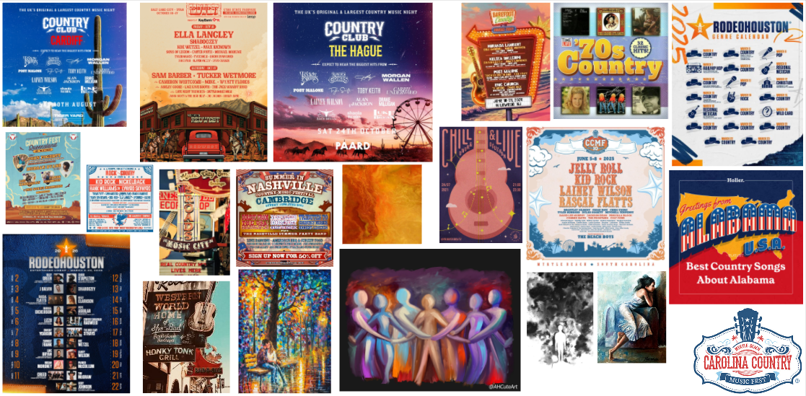 |
| *Kleuren, sfeer en beeldgebruik* | *Vormen, composities en richtingen* |

---

**Van Onderzoek naar Eerste Ideeën:**

Na het verzamelen van inspiratie zijn verschillende ideeën en mogelijke richtingen uitgewerkt. Hiervoor zijn onder andere de Crazy 8's gebruikt om in korte tijd meerdere concepten te bedenken en visueel te verkennen.

| Crazy 8's (1 t/m 4) | Crazy 8's (5 t/m 8) |
| :---: | :---: |
| 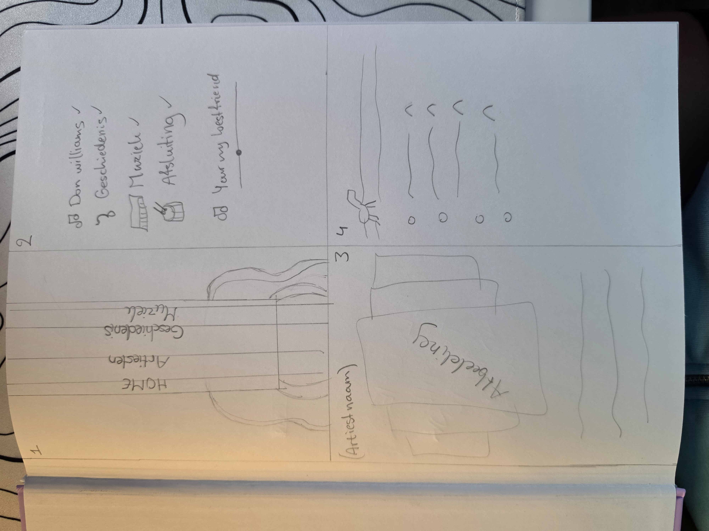 | 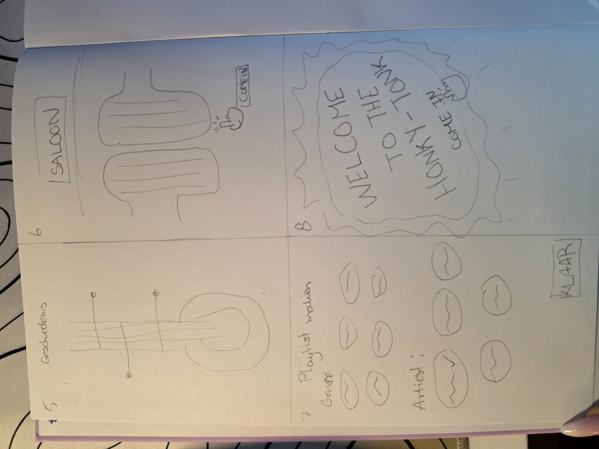 |
| *Eerste vier conceptschetsen* | *Laatste vier conceptschetsen* |

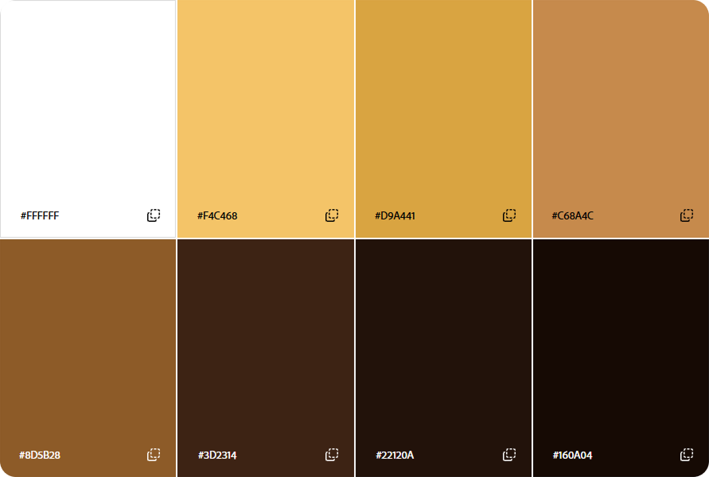

*Primaire kleuren palette*

---

**Het Saloon-startscherm & Thematische Beleving:**

Geïnspireerd door old-school countrybars en saloons ontstond het idee voor de introductiepagina. Dit resulteerde in een interactief startscherm met saloondeuren en dynamische, geanimeerde gradientkleuren op de achtergrond.

Tijdens het ontwerpproces is het startscherm meerdere keren aangepast voordat de uiteindelijke versie werd gekozen.

| Eerste Iteratie | Finale Versie |
| :---: | :---: |
|  | 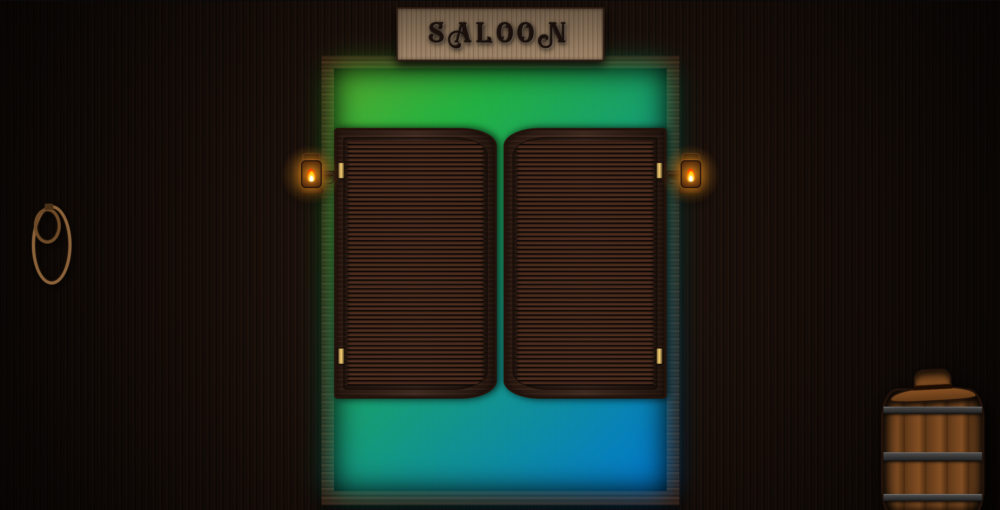 |
| *Procesfase startscherm* | *Uiteindelijke versie* |

Wanneer de bezoeker met de cursor over de saloondeuren beweegt, verschijnt een kleine cursor-tool met de tekst **“Come In”**. Na het aanklikken van de deuren wordt een animatie uitgevoerd waarbij de deuren opengaan en de gebruiker wordt verwelkomd op de website.

---

**De Opbouw van het Homescreen & Navigatie:**

Al tijdens de eerste schetsfase is de structuur van de website gekoppeld aan het thema muziek. Dit is onder andere terug te zien in de navigatie en de visuele lijnen van de startpagina, die zijn geïnspireerd op de snaren en hals van een akoestische gitaar.

Ook het homescreen is tijdens het proces meerdere keren aangepast.

| Eerste Iteratie | Finale Versie |
| :---: | :---: |
|  |  |
| *Procesfase homescreen* | *Uiteindelijke versie* |

De startpagina zelf is bewust overzichtelijk en rustig gehouden, zodat de verschillende onderdelen van de Digital Garden niet met elkaar concurreren. De content is verdeeld over gestapelde kaarten (*cards*). Deze kaarten versterken het gevoel van een fysiek plakboek en sluiten tegelijkertijd aan bij het idee van een Digital Garden waarin informatie steeds verder kan worden uitgebreid en verbonden.

---

**Specifieke Componenten & Micro-interacties:**

  - **Navbar & Responsief Banjo-menu:**

    De navigatiebalk sluit qua stijl aan bij de houten accenten en de algemene country-esthetiek van de website. Ook de navbar heeft verschillende ontwerpiteraties doorlopen voordat de uiteindelijke versie werd gekozen.

    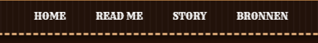

    *Uiteindelijke versie van de navigatiebalk.*

    Voor kleinere schermen is een apart mobiel menu ontworpen. Het oorspronkelijke idee was om hiervoor een gitaar als interactief element te gebruiken. Omdat een realistische gitaar met pure CSS onnodig complex zou worden, is gekozen voor een vereenvoudigde banjo.

    De banjo heeft meerdere iteraties doorlopen:

    | Banjo Iteratie 1 | Banjo Iteratie 2 | Finale Banjo-menu |
    | :---: | :---: | :---: |
    | 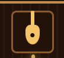 | 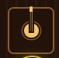 | 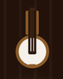 |
    | *Eerste opzet* | *Tweede iteratie* | *Uiteindelijk menu-icoon* |

    Door op het banjo-icoon te klikken, wordt het mobiele navigatiemenu geopend.

  - **Custom Scrollbar – Vinylplaat:**

    Om de standaard browser-scrollbar te vervangen door een element dat beter bij het thema past, is een custom scrollbar ontworpen in de vorm van een vinylplaat.

    

    *Ontwerp van de custom scrollbar.*

    Tijdens het scrollen verschijnen er muzieknoten rondom de plaat. Een gouden lijn beweegt mee en geeft visueel aan hoe ver de gebruiker zich op de pagina bevindt. Hierdoor wordt een functioneel onderdeel van de website tegelijkertijd onderdeel van de visuele identiteit.

---

**Bronnenpagina:**

  De bronnenpagina is bewust overzichtelijk en georganiseerd gehouden. Hier kunnen gebruikers eenvoudig de gebruikte bronnen, afbeeldingen en andere relevante materialen terugvinden.

  

  *De uiteindelijke bronnenpagina.*

### Retrospective
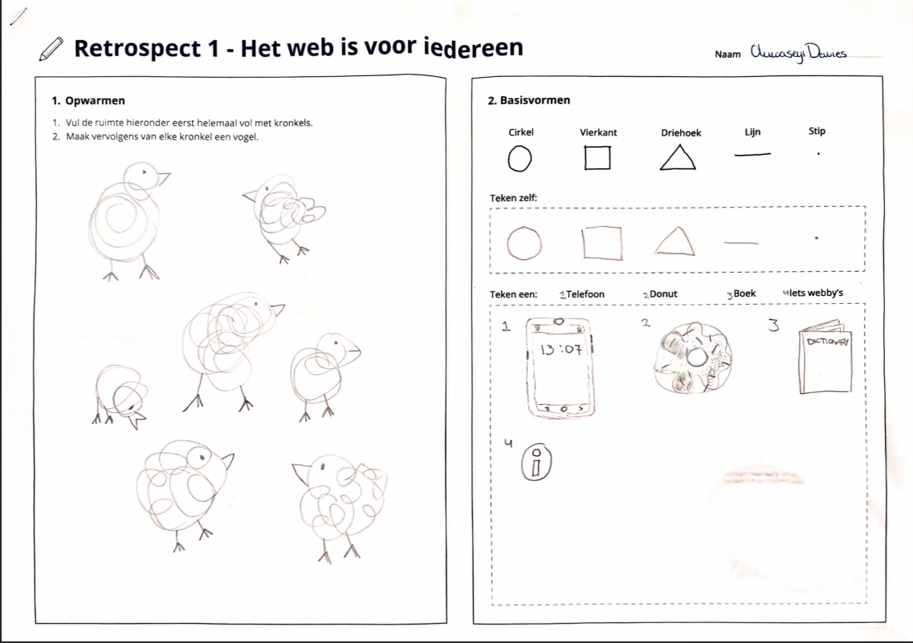

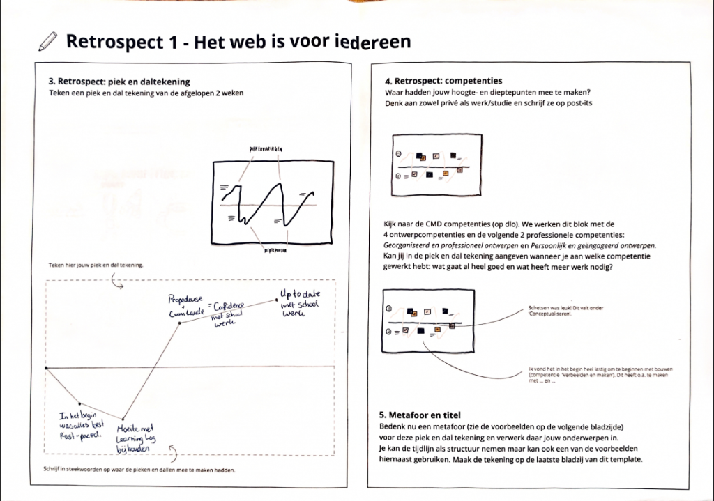

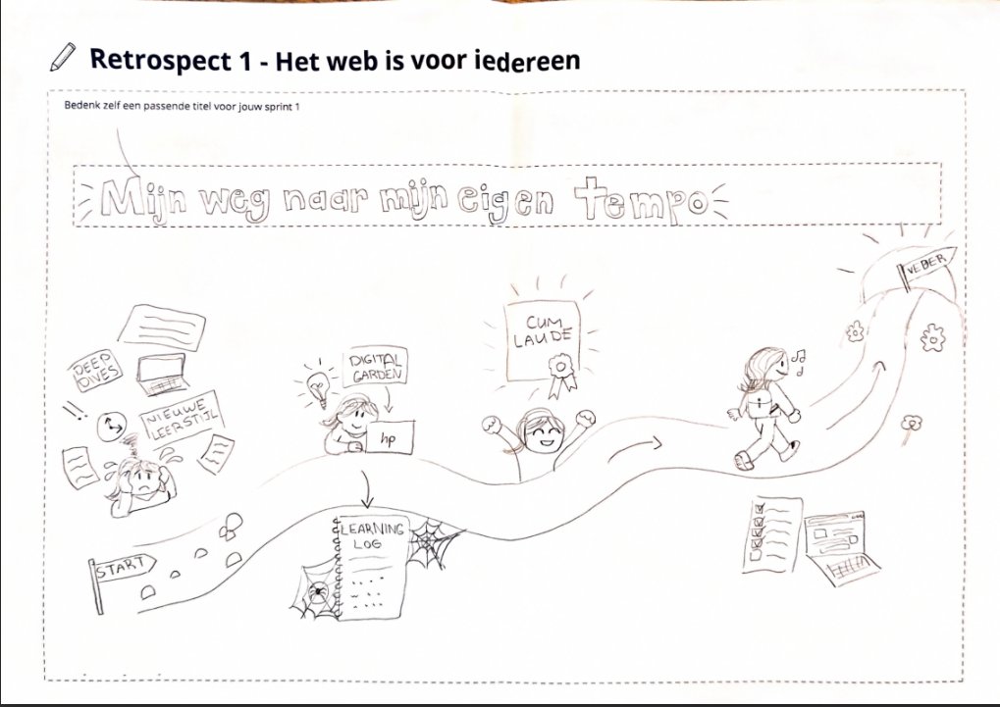

### Ontwerp als Samenhangend Geheel

Hoewel ieder onderdeel afzonderlijk is ontworpen, zijn de verschillende componenten bewust met elkaar verbonden. Het kleurenpalet, de houten en leren uitstraling, de muziekgerelateerde interacties, de saloondeuren, de banjo en de vinyl-scrollbar dragen allemaal bij aan dezelfde visuele identiteit. Hierdoor voelt de website niet als een verzameling losse elementen, maar als één samenhangende digitale omgeving rondom countrymuziek en de Texaanse cultuur.

## Bronnen

### Bronnen voor Onderzoek

<b>📂 Klik hier om alle onderzoeksbronnen te bekijken (10 bronnen)</b>

 

| Bron | Beschrijving | Link |
| :--- | :--- | :--- |
| **Country Music Hall of Fame** | Country Music History | [Openen](https://www.countrymusichalloffame.org/learn/country-music-history) |
| **Plumrose Publishing** | The History of Country Music | [Openen](https://plumrosepublishing.com/the-history-of-country-music/) |
| **Encyclopædia Britannica** | Bluegrass Music | [Openen](https://www.britannica.com/art/bluegrass-music) |
| **PBS (Ken Burns)** | Roots & Branches of Country Music | [Openen](https://www.pbs.org/kenburns/country-music/roots-branches-of-country-music) |
| **Grizzly Rose** | History of Country Music | [Openen](https://grizzlyrose.com/history-of-country-music/) |
| **Tulane University** | Music Rising: Country Music | [Openen](https://musicrising.tulane.edu/discover/themes/country-music/) |
| **Medium** | A Brief History of Country Music | [Openen](https://midweekcrisis.medium.com/a-brief-history-of-country-music-ca72e8fff803) |
| **Musicnotes** | History & Influences | [Openen](https://www.musicnotes.com/blog/an-american-tradition-the-history-of-country-music-influences/?srsltid=AfmBOopG-MGnrjlAKgoXNbYHh73PstFLviQs8-YRZ_68QN1us4Aj6wYG) |
| **Library of Congress** | Country Music Timeline | [Openen](https://www.loc.gov/collections/dolly-parton-and-the-roots-of-country-music/articles-and-essays/country-music-timeline/) |
| **OK History** | Country Music Entry | [Openen](https://www.okhistory.org/publications/enc/entry?entry=CO072) |

### Bronnen van Afbeeldingen

Een overzicht van alle visuele media, fotografie, posters en afbeeldingen die in dit project worden gebruikt.

Bestandsmap: `assets/resources/images/`

<b>📷 Klik om de Bronnentabel te Openen / Sluiten</b>

 

| Miniatuur | Bestandspad & Titel | Categorie | Bron / Uitgever | Originele Webkoppeling |
| :---: | :--- | :---: | :--- | :---: |
| 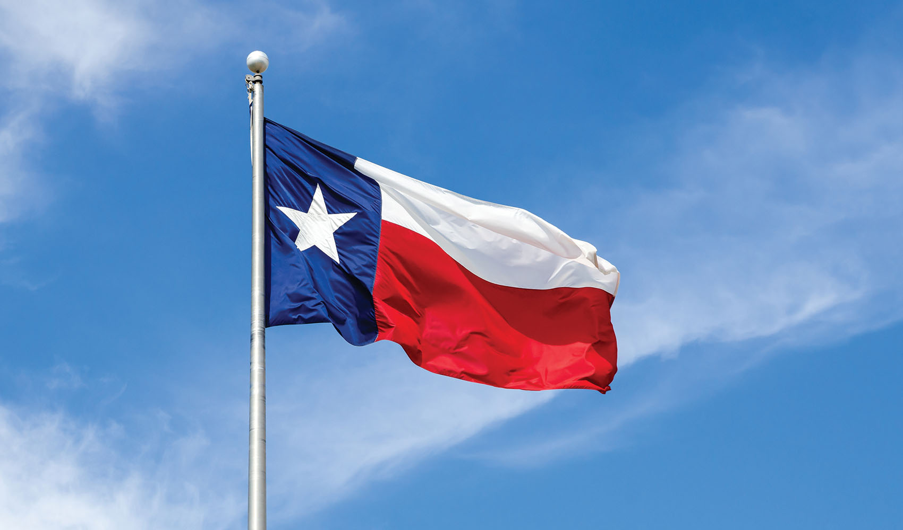 | **Vlag van Texas** `assets/resources/images/texasFlag.jpg` | `Landschap` | **Valley Homes** | [Bekijk Bron](https://valleyhomeslc.com/location/mobile-homes-for-sale-dumas-tx/) |
| 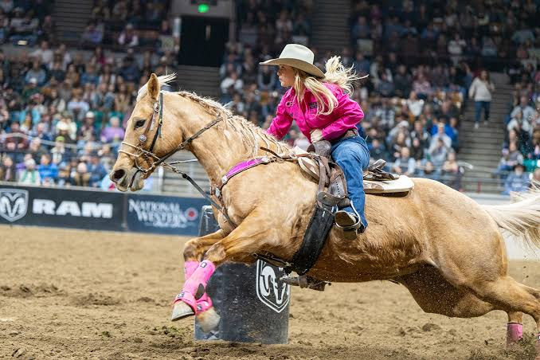 | **Rodeo Evenement** `assets/resources/images/rodeo.jpg` | `Evenementen & Posters` | **National Western Stock Show** | [Bekijk Bron](https://nationalwestern.com/rodeos/) |
| 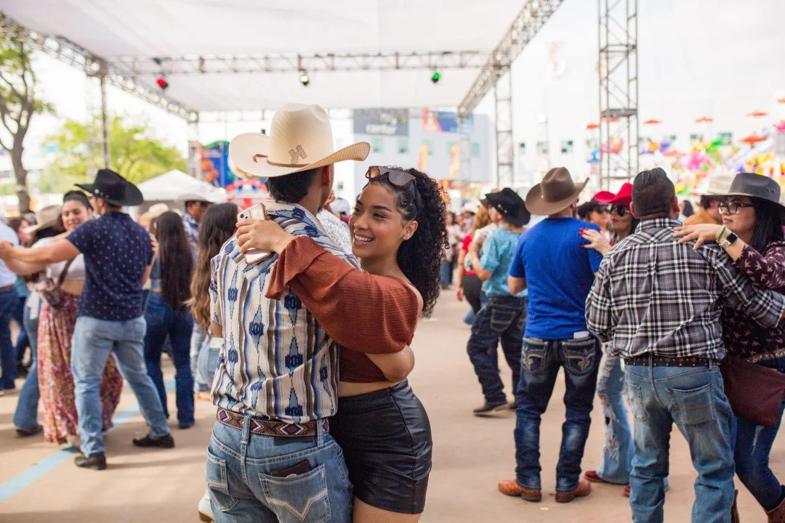 | **Country Day bij Houston Rodeo** `assets/resources/images/CountryDay.jpg` | `Evenementen & Posters` | **Houstonia Magazine** *Houston Livestock Show and Rodeo* | [Bekijk Bron](https://www.houstoniamag.com/arts-and-culture/2025/03/houston-rodeo-best-days-to-visit) |
| 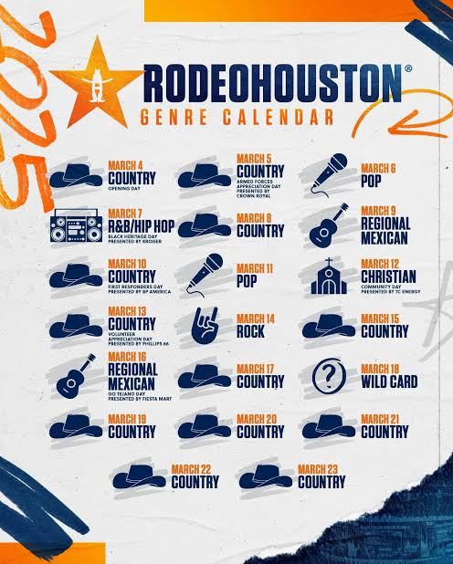 | **Festival Poster / Line-up** `assets/resources/images/FestivalPoster.jpg` | `Evenementen & Posters` | **Houston Chronicle** *Houston Livestock Show and Rodeo* | [Bekijk Bron](https://www.houstonchronicle.com/entertainment/music/article/houston-rodeo-genre-calendar-2025-acts-lineup-tix-19934612.php) |
| 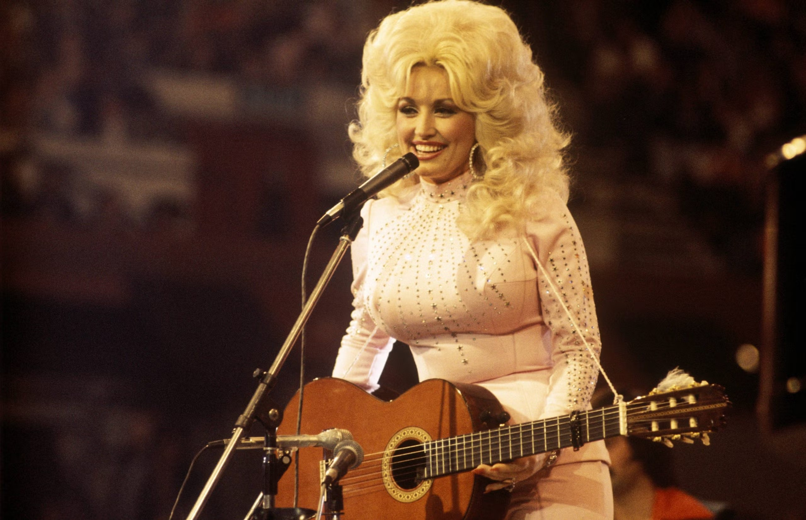 | **Dolly Parton** `assets/resources/images/artist-dolly.jpg` | `Artiesten` | **Daily Bruin** *Foto door Richard E. Aaron / Redferns / Getty Images* | [Bekijk Bron](https://dailybruin.com/2026/08/27/in-moments-remembering-queen-of-country-dolly-partons-career) |
| 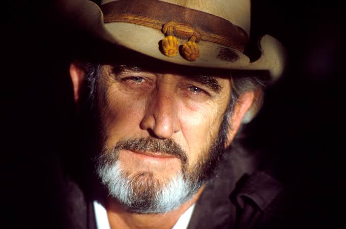 | **Don Williams** `assets/resources/images/artist_don.jpg` | `Artiesten` | **Getty Images** *Foto door Michael Putland* | [Bekijk Bron](https://www.gettyimages.nl/detail/nieuwsfoto%27s/don-williams-portrait-london-1989-nieuwsfotos/109364677?adppopup=true) |
| 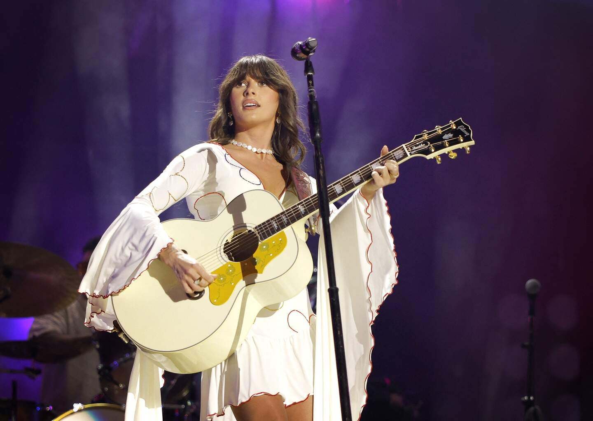 | **Ella Langley** `assets/resources/images/artist_ella.jpg` | `Artiesten` | **Woman's World** | [Bekijk Bron](https://www.womansworld.com/entertainment/celebrities/ella-langley-before-fame-was-totally-different-how-she-found-her-look) |
| 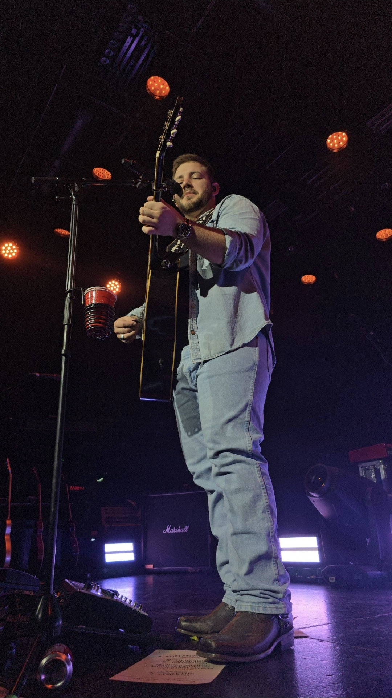 | **Kameron Marlowe** `assets/resources/images/artist_kameron.jpg` | `Artiesten` | **Oluwaseyi Davies** *Directe vermelding* | *Directe Vermelding* |
| 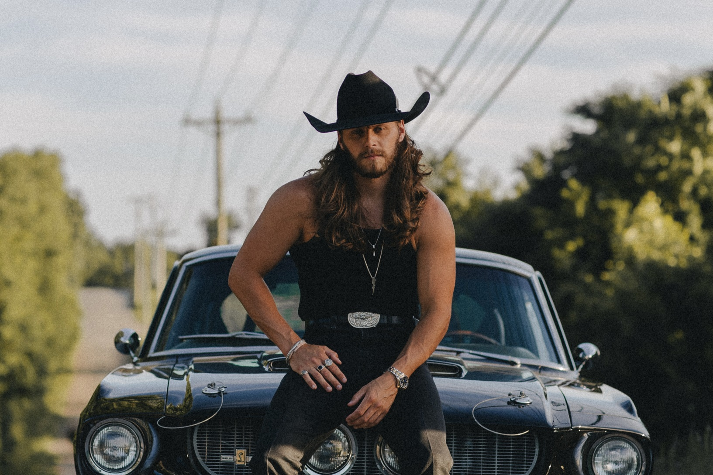 | **Warren Zeiders** `assets/resources/images/artist_warren.jpg` | `Artiesten` | **Wikipedia** | [Bekijk Bron](https://en.wikipedia.org/wiki/Warren_Zeiders) |

---
*Alle gebruikte afbeeldingen blijven het eigendom van de respectievelijke makers en uitgevers. Opgenomen voor educatieve en portfolio-doeleinden.*